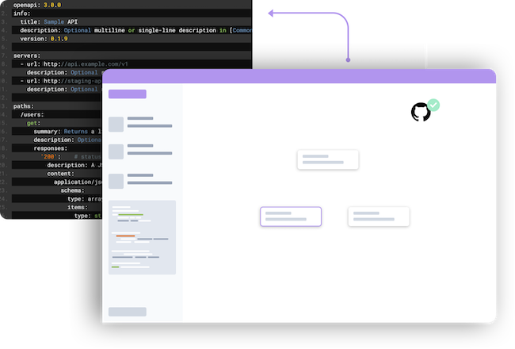

# 🏗 Rigflo

Rigflo is a visual interface for exploring and editing [OpenAPI](https://www.openapis.org/) documents. The tool aims to provide developers with an intiuitive interface to get up and running when building out APIs. By lowering the barrier of entry to working with OpenAPI documents, more developers can gain access to the various tools within the OpenAPI ecosystem.

---

## Features

- [x] Connect and route GET, POST, PUT, DELETE paths
- [x] Edit path metadata
- [x] Github integration
- [x] Auto-save via local storage
- [x] Export to YAML

## Development

1. Fork this repository: `gh repo fork https://github.com/oslabs-beta/rigflo`
2. Install dependencies: `npm install`
3. Start the development server: `npm start`

**Note: Rigflo uses Snowpack for fast unbundled development. If you're having issues starting the development server, reference [their docs](https://www.snowpack.dev/) for guidance.**

## Contributors

Rigflo is under active development in collaboration with [OS Labs](https://github.com/oslabs-beta/)

- [Akosua Kernizan](https://github.com/akernizan)
- [Garrett James](https://github.com/gjames5355)
- [James Scaggs](https://github.com/jamesscaggs)
- [Sam Carlile](https://github.com/samkcarlile)
